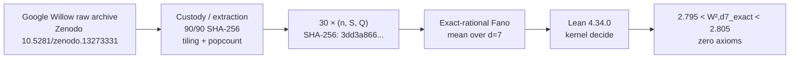

# W2-d7: Lean certificate over Google Willow experimental data

This repository contains a Lean 4.34.0 certificate for an exact-rational recomputation of the $d=7$ component of the Fano-factor analysis reported in [arXiv:2604.11963v1](https://arxiv.org/abs/2604.11963), using 30 experiments from the public Google Quantum AI Willow dataset.

## Result

The bound input consists of 30 sufficient-statistic triples `(n, S, Q)` derived from 90 independently hash-checked archive members (50,000 shots per experiment, 1.5 million shots total).

Lean kernel-checks:

$$
2.795 < W_{2,d=7}^{exact} < 2.805
$$

The certificate uses `Nat`/`Int` cross-multiplication and kernel `decide`.
`#print axioms w2_d7_certificate` reports no axioms.

The exact-rational value, when converted to binary64, is:

`2.7978273252888646`

which equals the independently reproduced float64 value at binary64 precision.

---

## Pipeline



---

## Evidence Identity

```text
Frozen target SHA-256:
02c9f057f3c80636a9287e4265f83e8d6e649f895f8268de7d4291ed16dbdb50

Bound input SHA-256:
3dd3a86624b53f3aead8972fd902cee7431c11d1f42199e05f9a055e08892b5f

Pre-extraction anchor:
2de083e8c1887e57a2b507465915c18e75bdb3c4

Gated commit:
bc7c76e1d12062ba036d9ecddc4f2257928148d6

Independent review:
Sonnet Gate 001 (cdcfc21) — BLOCKED on authority/provenance; technical artifact survives review.
Sonnet Gate 002 (e670ff7) — BLOCKED on authority/provenance; technical artifact remained unchanged and 9/9 integrity checks passed.

Authority status:
SIGNED HUMAN AUTHORIZATION / FINAL RATIFICATION PENDING MAIN TAG

Post-extraction record:
POST_EXTRACTION_RECORD_v3.sha256 (pins all 9 completed artifacts)

Pre-extraction freeze record:
FREEZE_RECORD_v3.sha256 (pins pre-extraction target skeleton)
```

---

## Reproduce (30 Seconds)

Requires [Lean 4](https://lean-lang.org/) (tested on 4.34.0):

> [!NOTE]
> `FREEZE_RECORD_v3.sha256` represents the pre-extraction freeze snapshot (pinning the initial specification and binding skeleton before unpacking raw data). `POST_EXTRACTION_RECORD_v3.sha256` is the post-extraction record pinning the completed artifacts and proof files.

```bash
# 1. Verify integrity of all post-extraction evidence
sha256sum -c POST_EXTRACTION_RECORD_v3.sha256

# 2. Re-generate Lean source mechanically from bound input
python3 generate_W2D7_lean_v3.py W2D7_INPUT.json W2D7_v3.lean w2_d7_certificate

# 3. Kernel-check the theorem in Lean 4
lean W2D7_v3.lean
```

**Expected output**:
```text
'w2_d7_certificate' does not depend on any axioms
true
true
true
true
true
```

---

## What Lean Proves / Does Not Prove

- **What Lean proves**: Lean verifies exact arithmetic over the 30 bound `(n, S, Q)` integer triples; it checks that $2.795 < W_{2,d=7}^{exact} < 2.805$ holds without axioms, and guarantees that list length is 30, all denominators are positive, and variance constraints are satisfied.
- **What Lean does not prove**:
  - Raw-byte custody, archive SHA-256 verification against `data_manifest.json`, packed-byte tiling checks, and detector popcount are enforced at the **L1 custody layer** (`extract_w2d7.py`), not inside Lean.
  - This certificate covers the $d=7$ component of $W_2$; it does not certify full $W_2$ (which spans $d \in \{3, 5, 7\}$) nor does it prove the full Stenberg paper.
  - Lean does not prove an IEEE-754 equivalence theorem; it proves the exact-rational value directly, which evaluates to `2.7978273252888646` in binary64.

---

## Data Provenance & Licensing (L0)

- **Upstream Experimental Dataset**:
  - Creator: **Google Quantum AI** (2024)
  - Title: *Data for "Quantum error correction below the surface code threshold"*
  - DOI: [10.5281/zenodo.13273331](https://doi.org/10.5281/zenodo.13273331)
  - License: [CC BY 4.0](https://creativecommons.org/licenses/by/4.0/)
- **Third-Party Preprint Under Reproduction**:
  - Author: **Selina Stenberg** (2026)
  - Title: *The Rotation Gap Is Not An Error* ([arXiv:2604.11963v1](https://arxiv.org/abs/2604.11963))
  - Code: [github.com/SelinaAliens/The_Rotation_Gap_Is_Not_An_Error](https://github.com/SelinaAliens/The_Rotation_Gap_Is_Not_An_Error) (MIT License)
- **Derived Certificates & Tooling**:
  - The 30 triples `(n, S, Q)` in `W2D7_INPUT.json` are derived under CC BY 4.0.
  - All formal certificates, generators, and verification records in this repository are released under the [MIT License](LICENSE) (Copyright (c) 2026 VolMax Studio Lab / Ivan Nestorov).

---

## Gate History / Audit Trail

1. **Project Chat Checkpoints (FABLE-002 through FABLE-005)**: Transcriptions by assistant Ananke of gate outputs produced by Claude in the VolMax Observatory Project chat session. Not issued or endorsed by Anthropic as an institutional review and not independent of the operator. (See [`PROVENANCE_CORRECTION_2026-09-21.md`](PROVENANCE_CORRECTION_2026-09-21.md), [`GATE_PROVENANCE_CORRECTION.md`](GATE_PROVENANCE_CORRECTION.md), and [`HISTORICAL_AGENT_GENERATED_FABLE_005.md`](HISTORICAL_AGENT_GENERATED_FABLE_005.md)).
2. **First Independent Review (Sonnet Gate 001)**: Performed by Claude (Anthropic, Sonnet) on commit `cdcfc21`. Verdict: Technical artifact **SURVIVES-REVIEW**; authority/provenance flagged for human ratification (see [`INDEPENDENT_GATE_SONNET_001.md`](INDEPENDENT_GATE_SONNET_001.md)).
3. **Second Independent Review (Sonnet Gate 002)**: Evaluated signed pre-merge authorization commit `e670ff7`. Verdict: **BLOCKED** on authority/provenance; technical artifact remained unchanged and 9/9 integrity checks passed (see [`INDEPENDENT_GATE_SONNET_002.md`](INDEPENDENT_GATE_SONNET_002.md)).
4. **Limitations & Governance**: Technical execution observations documented in [`POST_GATE_LIMITATIONS.md`](POST_GATE_LIMITATIONS.md); pre-merge authorization and final main ratification workflow established in [`HUMAN_RATIFICATION.md`](HUMAN_RATIFICATION.md) and [`PROVENANCE_CORRECTION_2026-09-21.md`](PROVENANCE_CORRECTION_2026-09-21.md).
